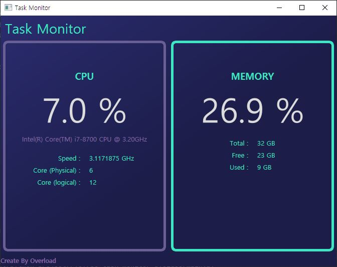

# PySide6 - Simple PC task monitor
## 1. What is this
</img>  
This program reads and displays CPU and RAM information of Windows PC in real time using QThread.
 This program was written using PySide6 and Python 3.8.

## 2. Install required packages
- Python3+ (The version of Python used when making this program is 3.8)
- PySide (PySide6)
- Pyinstaller

If you want to build this source, run this command in your project's directory.
<pre><code>pyinstaller --onefile --windowed main.py</code></pre>

